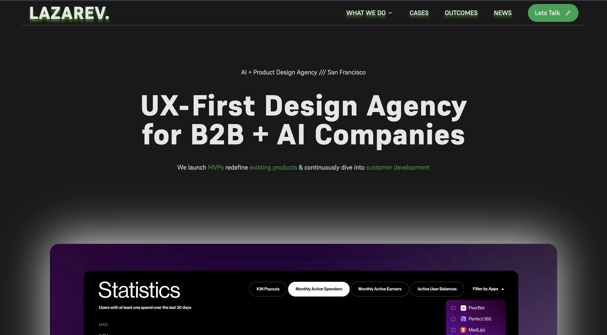
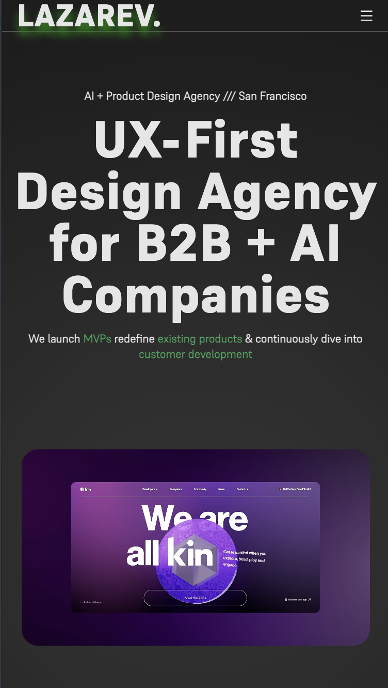
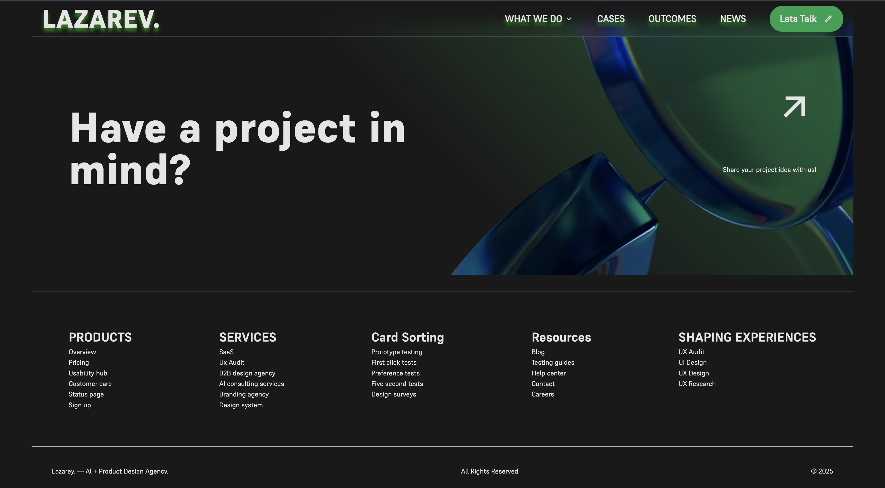

# 🖤 Lazarev Agency Clone

A **frontend clone** of [Lazarev.agency](https://www.lazarev.agency/), built from scratch using **HTML5 and CSS3**.
This project was created for **learning purposes** to practice responsive design, semantic markup, and modern CSS effects.

---

## 🚀 Features
- 🎨 **Pixel-Perfect UI Clone** – Replicates Lazarev’s clean and bold design language.
- 📱 **Responsive Layout** – Works smoothly across desktop, tablet, and mobile devices.
- ♿ **Accessibility Ready** – Semantic HTML, alt text for images, keyboard navigable.
- ⚡ **Performance Optimized** – Lazy-loaded images, optimized paths for GitHub Pages hosting.
- 🎬 **CSS Animations** – Hover effects, transitions, and smooth keyframe animations.

---

## 🛠️ Tech Stack
- **HTML5** – Semantic sections (`header`, `main`, `section`, `article`, `footer`).
- **CSS3** – Flexbox, Grid, transitions, keyframe animations, gradients.
- **GitHub Pages** – For deployment.

---


## 📸 Preview









---

## 🔧 Installation & Setup
1. Clone the repository:
   ```bash
   git clone https://github.com/mohitchauhan-stack/lazarev-clone.git

2. Open the folder:
    cd lazarev-clone

3. Run with Live Server (VS Code extension) or just open index.html in your browser.

🌍 Deployment

Deployed using GitHub Pages:
👉 [View on GitHub Pages](https://mohitchauhan-stack.github.io/Lazarev-Clone/)

📌 Notes

This project is made for educational purposes only.

All design credit goes to Lazarev.agency